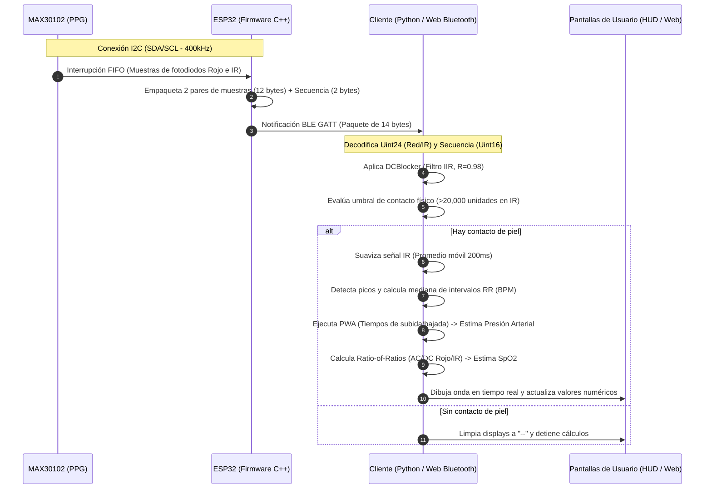

# Documentación Técnica Profesional: Estación Médica de Diagnóstico Cardiovascular

Este documento proporciona una descripción detallada, arquitectónica y operativa del software y hardware que integran la **Estación Médica de Diagnóstico Cardiovascular**, incluyendo el firmware del dispositivo ESP32, la aplicación de escritorio basada en Python/PyQt6 y la aplicación web basada en la API Web Bluetooth.

---

## 1. Descripción General del Proyecto

### Objetivo Principal
El objetivo principal del proyecto es proveer una plataforma autónoma e integrada de monitorización cardiovascular no invasiva de grado prototipo. El sistema realiza la captura, filtrado, visualización y análisis de la señal fotopletismográfica (PPG) de reflectancia para estimar en tiempo real tres variables clínicas fundamentales:
1. **Ritmo Cardíaco (BPM)**
2. **Presión Arterial (Sistólica y Diastólica)**
3. **Saturación de Oxígeno en Sangre ($SpO_2$)**

### Problema que Resuelve
La toma de signos vitales tradicionales requiere de múltiples equipos (oxímetros de pulso independientes, tensiómetros de inflado braquial que causan incomodidad y estrés al paciente) y carece de portabilidad automática y conectividad abierta. Este sistema unifica los sensores en una única **pulsera de muñeca inteligente**, transmitiendo de forma inalámbrica y de bajo consumo los datos a interfaces de escritorio y web gratuitas sin necesidad de infraestructura de red local.

### Alcance Actual del Sistema
El sistema consta de tres capas funcionales en producción:
* **Capa Física (Firmware ESP32)**: Lee el sensor MAX30102 mediante I2C a 100 Hz y actúa como servidor BLE, enviando paquetes crudos mediante notificaciones estructuradas de 14 bytes.
* **Capa de Escritorio (Aplicación PyQt6)**: Software ejecutable standalone para Windows que se vincula con la pulsera, grafica la onda filtrada, ejecuta algoritmos DSP mediante Numpy y exporta estudios a archivos CSV locales.
* **Capa Web (Web App)**: Landing page interactiva que implementa la API W3C de **Web Bluetooth** para conectar el dispositivo directamente a navegadores basados en Chromium (Chrome, Edge, Opera), portando la visualización gráfica en Canvas y los algoritmos matemáticos al cliente web sin descargas.

---

## 2. Arquitectura del Proyecto

### Estructura de Carpetas y Archivos
```text
tensiometro_extract/
│
├── tensiometro_reconstructed.py     # Aplicación de escritorio principal (PyQt6 / Bleak / Matplotlib)
├── tensiometro-final.spec           # Archivo de especificación de empaquetado para PyInstaller
├── DOCUMENTACION.md                 # [ESTE ARCHIVO] Documentación técnica del proyecto
│
└── landing/                          # Código fuente de la aplicación web y landing page
    ├── index.html                    # Estructura HTML de la landing page y el monitor web
    ├── style.css                     # Hojas de estilo personalizadas con identidad visual GobMx
    ├── index.js                      # Lógica de Web Bluetooth, DSP y animaciones en JavaScript
    ├── prototype.png                 # Imagen renderizada del diseño físico 3D de la pulsera
    └── wiring.png                    # Diagrama de cableado físico de conexiones I2C
```

### Explicación de Módulos y Componentes
1. **Firmware Arduino/C++ (Código Embebido)**:
   * Inicializa el bus I2C en modo rápido ($400\text{ kHz}$) y configura el registro del MAX30102 para muñeca (LEDs a brillo moderado para evitar calentamiento, muestreo sin promedio a $100\text{ Hz}$).
   * Levanta el servidor GATT BLE con el servicio primario de diagnóstico.
   * Acumula 2 muestras (Rojo/IR) en un búfer local de 12 bytes, añade 2 bytes de secuencia y envía notificaciones por Bluetooth.
2. **Módulo de Escritorio (`tensiometro_reconstructed.py`)**:
   * `DCBlocker`: Implementa un filtro recursivo que elimina el offset de corriente continua del sensor para centrar la señal PPG.
   * `BLEWorker`: Hilo de procesamiento independiente (`QThread`) para aislar la comunicación asíncrona de Bleak y evitar congelar la interfaz gráfica.
   * `MainWindow`: Ventana principal que administra widgets de control, visualiza la señal mediante un lienzo Matplotlib integrado y ejecuta temporizadores para calcular variables vitales cada segundo.
3. **Módulo Web (`landing/index.js`)**:
   * Implementa los mismos algoritmos que la versión de escritorio, utilizando JavaScript puro de alto rendimiento.
   * `DCBlocker (JS)`: Réplica exacta del filtro de escritorio.
   * `Canvas Plotter`: Dibuja un barrido continuo en un canvas HTML5 a través de un bucle optimizado con `requestAnimationFrame` que simula un osciloscopio médico.

### Flujo General de Funcionamiento



---

## 3. Tecnologías Utilizadas

### Capa Embebida (Firmware)
* **C++**: Lenguaje para el desarrollo del firmware.
* **SparkFun MAX3010x Library**: Control y lectura de registros del sensor MAX30102.
* **ESP32 BLE Arduino (NimBLE / BLE Device Core)**: Creación de perfiles GATT, emparejamiento por anuncios y envío de notificaciones.

### Capa de Escritorio (Desktop App)
* **Python 3.10+**: Lenguaje de ejecución de la aplicación.
* **PyQt6**: Framework gráfico multiplataforma para diseñar la interfaz de estilo consola HUD.
* **Bleak**: Librería asíncrona compatible con Windows/macOS/Linux para interactuar con dispositivos BLE.
* **qasync**: Integra el bucle de eventos asíncronos de `asyncio` con el de la interfaz gráfica `Qt6`, evitando bloqueos.
* **Numpy**: Procesamiento matemático de señales y vectores de datos (filtros, picos, medianas).
* **Matplotlib**: Biblioteca para renderizar y actualizar la gráfica de la señal PPG a 60 fps en la GUI.

### Capa Web (Web App)
* **HTML5**: Estructura semántica de la consola del monitor.
* **CSS3**: Diseño responsivo y estilización de grado médico (cuadrícula, brillo luminoso, animaciones de latido).
* **JavaScript (ES6+)**: Lógica de cliente, control del canvas y algoritmos DSP.
* **Web Bluetooth API**: Estándar W3C que permite al navegador comunicarse de manera directa e inalámbrica con dispositivos BLE.

---

## 4. Funcionamiento del Código y Algoritmos

### 4.1 Desempaquetado de Paquetes BLE
Los datos del sensor MAX30102 son de 18 bits de resolución, lo que requiere 3 bytes para representarse por muestra. El firmware empaqueta 2 muestras de ambos LEDs (Rojo e Infrarrojo) para optimizar el ancho de banda del canal BLE, reduciendo las llamadas a la función de notificación del stack.

La trama recibida por el cliente es de 14 bytes con la siguiente distribución binaria:

| Rango de Bytes | Variable | Tipo de Dato | Codificación |
| :--- | :--- | :--- | :--- |
| **0 - 2** | Muestra 1: LED Rojo | uint24 (3 bytes) | Big Endian |
| **3 - 5** | Muestra 1: LED Infrarrojo | uint24 (3 bytes) | Big Endian |
| **6 - 8** | Muestra 2: LED Rojo | uint24 (3 bytes) | Big Endian |
| **9 - 11** | Muestra 2: LED Infrarrojo | uint24 (3 bytes) | Big Endian |
| **12 - 13** | Número de Secuencia | uint16 (2 bytes) | Little Endian |

#### Algoritmo de decodificación en JavaScript:
```javascript
const red1 = (view.getUint8(0) << 16) | (view.getUint8(1) << 8) | view.getUint8(2);
const ir1 = (view.getUint8(3) << 16) | (view.getUint8(4) << 8) | view.getUint8(5);
const red2 = (view.getUint8(6) << 16) | (view.getUint8(7) << 8) | view.getUint8(8);
const ir2 = (view.getUint8(9) << 16) | (view.getUint8(10) << 8) | view.getUint8(11);
const seq = view.getUint16(12, true);
```

### 4.2 Filtro Pasabanda Butterworth (IIR Filter)
La señal PPG en reflectancia se monta sobre una componente de corriente continua (DC) muy grande debido a la absorción constante de tejidos óseos, piel y sangre estática, y contiene ruidos de movimiento e interferencia eléctrica. Para remover el offset y aislar la banda útil del pulso, se aplica un **filtro paso-banda IIR Butterworth de orden 4 con frecuencias de corte entre $0.5\text{ Hz}$ y $8.0\text{ Hz}$** ($fs = 100\text{ Hz}$).

#### Implementación en tiempo real:
Para garantizar la estabilidad numérica y la eficiencia en microcontroladores y computadoras cliente, el filtro se descompone en 4 secciones de segundo orden (SOS o Biquads) y se calcula en formato directo II en cada muestra:
\[y_i[n] = b_{0,i} w_i[n] + b_{1,i} w_i[n-1] + b_{2,i} w_i[n-2]\]
donde:
\[w_i[n] = x_i[n] - a_{1,i} w_i[n-1] - a_{2,i} w_i[n-2]\]

Esta implementación remueve simultáneamente la componente DC (drift por debajo de $0.5\text{ Hz}$) y el ruido de alta frecuencia (por encima de $8.0\text{ Hz}$).

### 4.3 Detección de Contacto (Skin Contact Detection)
Para evitar cálculos fantasmas causados por el sensor expuesto al aire o luz ambiental directa, el sistema verifica las últimas 50 muestras del canal de luz infrarroja cruda.
* Si el promedio de la señal IR cruda es menor a **$20,000$ unidades**, el sistema determina que el dispositivo se ha retirado de la muñeca.
* Inmediatamente, la interfaz cambia al estado `🔴 Sin contacto`, apaga las animaciones de latido y limpia las variables a `--`.

---

### 4.4 Algoritmo de Estimación de Signos Vitales

#### A. Ritmo Cardíaco (BPM)
1. **Suavizado Paso Bajo**: Aplica un filtro de media móvil sobre la señal IR filtrada con una ventana temporal de $200\text{ ms}$. El tamaño en muestras de la ventana se calcula de forma adaptativa según la frecuencia de llegada de paquetes real del hardware:
   \[\text{Window Size} = \max(5, \text{int}(\text{actualFreq} \cdot 0.20))\]
2. **Umbral Adaptativo**: Determina los valores máximos y mínimos de la ventana activa para calcular el rango de amplitud. Si el rango es menor a $1000$ unidades, la señal se descarta por baja amplitud. El umbral se establece en la mitad del rango:
   \[\text{Umbral} = y_{\min} + (y_{\max} - y_{\min}) \cdot 0.50\]
3. **Detección de Picos**: Se detecta un pico en la muestra $i$ si:
   * Es un máximo local: $y[i] > y[i-1]$ y $y[i] > y[i+1]$
   * Supera el umbral: $y[i] > \text{Umbral}$
   * Respeta la distancia refractaria mínima de latido (mínimo $400\text{ ms}$ entre picos, lo que equivale a un límite fisiológico de $150\text{ BPM}$).
4. **Mediana RR**: Se calculan los intervalos de tiempo en segundos reales entre los picos detectados. Para evitar distorsiones por falsos picos o arritmias momentáneas, se calcula la mediana de los intervalos válidos ($0.33\text{ s} \le t_{\text{intervalo}} \le 1.5\text{ s}$).
   \[\text{BPM} = \frac{60.0}{\text{mediana}(t_{\text{intervalos}})}\]

#### B. Presión Arterial (Método PWA)
A partir de los picos detectados, se buscan los valles mínimos locales (onsets) entre ellos. Esto permite definir la forma de la onda del pulso de cada latido individual. Se miden dos variables en segundos de reloj:
* **Tiempo de subida ($T_s$)**: Duración desde el valle hasta el pico (fase sistólica de eyección de sangre).
* **Tiempo de bajada ($T_d$)**: Duración desde el pico hasta el siguiente valle (fase diastólica de llenado).

A partir de los promedios de estos tiempos, se alimentan las ecuaciones de regresión lineal empíricas del sistema:
$$\text{Presión Sistólica (SBP)} = 120.0 + 0.15 \cdot (\text{BPM} - 70.0) - 75.0 \cdot (T_s - 0.12)$$
$$\text{Presión Diastólica (DBP)} = 80.0 + 0.08 \cdot (\text{BPM} - 70.0) - 25.0 \cdot (T_d - 0.35)$$

* **Restricción**: Se limitan fisiológicamente los valores ($SBP \in [95, 145]\text{ mmHg}$, $DBP \in [60, 95]\text{ mmHg}$) y se asegura una presión de pulso diferencial mínima de $25\text{ mmHg}$.

#### C. Saturación de Oxígeno ($SpO_2$)
El cálculo utiliza las componentes de los LEDs rojo e infrarrojo en una ventana de 3 segundos ($300$ muestras):
1. **Componente Continua (DC)**: Media aritmética de las muestras de la señal cruda ($Red_{raw}$, $IR_{raw}$).
2. **Componente Alterna (AC)**: Amplitud pico a pico (máximo $-$ mínimo) de la señal filtrada y suavizada ($Red_{filt}$, $IR_{filt}$).
3. **Ratio de Ratios ($R$)**:
   \[R = \frac{AC_{\text{Rojo}} / DC_{\text{Rojo}}}{AC_{\text{IR}} / DC_{\text{IR}}}\]
4. **Estimación porcentual**:
   \[SpO_2 = 104.0 - 17.0 \cdot R\]
    * El valor resultante es clampeado entre $80\%$ y $100\%$.

### 4.5 Calibración de Tono de Piel por Ángulo ITA
La concentración de melanina en la piel absorbe la luz de los LEDs (especialmente la roja, de $660\text{ nm}$), atenuando la amplitud AC y alterando la relación CA/CC de la señal PPG. Para corregir este sesgo óptico, el sistema calcula el Ángulo de Tipología Individual (ITA) a partir de los valores promedio de color de la piel en una Región de Interés (ROI) central de $100\times100$ píxeles de una fotografía:

1. **Conversión RGB a CIELab**:
   Se normaliza RGB a $[0, 1]$, se convierte a XYZ (bajo iluminante D65) y finalmente al espacio de color perceptual CIELab.
2. **Cálculo de Ángulo ITA**:
   \[\text{ITA} = \arctan\left(\frac{L^* - 50}{b^*}\right) \times \frac{180}{\pi}\]
3. **Clasificación y Offset de Corrección**:
   * **Muy clara** ($\text{ITA} > 55^\circ$): Offset $SpO_2$: $+0.0\%$, SBP: $+0.0\text{ mmHg}$, DBP: $+0.0\text{ mmHg}$.
   * **Clara** ($41^\circ\text{ a }55^\circ$): Offset $SpO_2$: $+0.0\%$, SBP: $+0.0\text{ mmHg}$, DBP: $+0.0\text{ mmHg}$.
   * **Intermedia** ($28^\circ\text{ a }41^\circ$): Offset $SpO_2$: $+0.2\%$, SBP: $-0.5\text{ mmHg}$, DBP: $-0.2\text{ mmHg}$.
   * **Morena** ($10^\circ\text{ a }28^\circ$): Offset $SpO_2$: $+0.6\%$, SBP: $-1.0\text{ mmHg}$, DBP: $-0.5\text{ mmHg}$.
   * **Oscura** ($-30^\circ\text{ a }10^\circ$): Offset $SpO_2$: $+1.2\%$, SBP: $-2.0\text{ mmHg}$, DBP: $-1.0\text{ mmHg}$.
   * **Muy oscura** ($\text{ITA} < -30^\circ$): Offset $SpO_2$: $+2.0\%$, SBP: $-3.5\text{ mmHg}$, DBP: $-1.8\text{ mmHg}$.

Estos offsets son sumados dinámicamente a las ecuaciones de $SpO_2$ y de presión (PWA) de la aplicación para compensar la absorción óptica cutánea.

---

## 5. Modelo de Datos y Almacenamiento

El proyecto no utiliza un motor de base de datos relacional (como MySQL o SQLite) ni no relacional (como MongoDB) para conservar la ligereza de ejecución del software.

### Modelo de Almacenamiento en CSV
El almacenamiento de las sesiones de estudio del paciente se basa en la escritura de archivos de texto plano separados por comas (CSV). Cada fila del archivo registra una muestra recibida.

#### Estructura del Archivo CSV:
| Columna | Nombre en Encabezado | Tipo de Dato | Descripción |
| :--- | :--- | :--- | :--- |
| **1** | `Tiempo_s` | Float | Tiempo relativo en segundos transcurrido desde el inicio de la grabación |
| **2** | `PPG_Rojo_Cruda` | Integer | Señal digital cruda de reflectancia del LED Rojo |
| **3** | `PPG_IR_Cruda` | Integer | Señal digital cruda de reflectancia del LED Infrarrojo |
| **4** | `PPG_Rojo_Filtrada` | Float | Señal del LED Rojo centrada tras pasar por el `DCBlocker` |
| **5** | `PPG_IR_Filtrada` | Float | Señal del LED Infrarrojo centrada tras pasar por el `DCBlocker` |

---

## 6. Especificación de la Interfaz BLE (API del Dispositivo)

La comunicación inalámbrica se rige bajo la especificación del protocolo de perfiles genéricos de atributos (GATT) de Bluetooth Low Energy. El microcontrolador ESP32 expone un único servicio primario con dos características operativas:

* **UUID del Servicio de Diagnóstico**: `4fafc201-1fb5-459e-8fcc-c5c9c331914b`

### Características del Servicio

#### 1. Característica de Transmisión de Datos
* **UUID**: `beb5483e-36e1-4688-b7f5-ea07361b26a8`
* **Propiedades**: `NOTIFY`
* **Descripción**: Envía flujos de datos continuos estructurados en paquetes binarios de 14 bytes cuando la transmisión está activa.

#### 2. Característica de Control de Transmisión
* **UUID**: `12345678-1234-1234-1234-123456789abc`
* **Propiedades**: `WRITE`
* **Descripción**: Permite que el cliente envíe comandos de texto simple codificados en UTF-8 para alterar el flujo de energía del sensor y el stack:
  * Escribir `"START"` inicia las lecturas del FIFO I2C y las notificaciones BLE.
  * Escribir `"STOP"` suspende las lecturas y notificaciones, colocando al sensor y al microcontrolador en modo de espera.

---

## 7. Estado Actual del Desarrollo

A continuación se presenta una auditoría del estado actual de las funcionalidades del proyecto:

| Funcionalidad | Estado | Detalles Técnicos / Observaciones |
| :--- | :--- | :--- |
| **Lectura I2C del MAX30102** | **Implementada** | Funciona a velocidad estándar e I2C rápido ($400\text{ kHz}$) sin pérdidas. |
| **Servidor y Anuncios BLE** | **Implementada** | Se anuncia con el nombre `Tensiometro_Pulsera` y reconecta tras pérdidas de enlace. |
| **Filtro Pasabanda Butterworth** | **Implementada** | Filtro Butterworth de orden 4 (0.5 - 8.0 Hz) en tiempo real mediante secciones SOS/Biquad. |
| **Visualización en Gráfica (HUD)** | **Implementada** | Python implementa Matplotlib y la Web App implementa Canvas de alta velocidad de barrido. |
| **Detección de Contacto** | **Implementada** | Desactiva las lecturas inmediatamente a los $500\text{ ms}$ de retirar el sensor. |
| **Algoritmo BPM en vivo** | **Implementada** | Estable mediante la mediana RR. Requiere al menos 3 latidos estables iniciales. |
| **Estimación de SpO2** | **Implementada** | Cálculo preciso usando amplitudes pico a pico en ventanas de 3 segundos. |
| **Estimación de Presión Arterial** | **Implementada** | Algoritmo PWA funcional calibrado con estimación de sístole/diástole en tiempo real. |
| **Calibración de tono de piel (ITA)** | **Implementada** | Clasificación por foto (conversión CIELab en cliente) y corrección dinámica en Python y JS. |
| **Exportación CSV** | **Implementada** | Exporta archivos planos locales con marcas de tiempo reales en ambas plataformas. |
| **Persistencia Histórica de Pacientes** | **Pendiente** | No existe historial de pacientes o base de datos local embebida (SQLite/LocalStorage). |
| **Cifrado de Enlace BLE** | **Pendiente** | La comunicación no requiere emparejamiento con clave (PIN) ni cifrado de enlace. |

---

## 8. Instalación y Ejecución

### Requisitos Previos
* **Hardware**: Placa de desarrollo ESP32 (30 pines / NodeMCU), Sensor MAX30102, cables de conexión, protoboard o carcasa impresa en 3D.
* **Firmware**: Arduino IDE (versión 2.0+) con el soporte de placas ESP32 instalado y las librerías `Wire` y `MAX30105` (de SparkFun).
* **Entorno Python**: Python 3.10 o posterior instalado en el sistema operativo Windows.

### 8.1 Instalación y Ejecución de la Aplicación de Escritorio
1. Abre tu terminal de PowerShell o CMD en la carpeta raíz del proyecto.
2. Instala las dependencias requeridas ejecutando:
   ```bash
   pip install PyQt6 bleak qasync numpy matplotlib
   ```
3. Ejecuta la aplicación de monitoreo:
   ```bash
   python tensiometro_reconstructed.py
   ```

### 8.2 Ejecución de la Aplicación Web (Web App)
La aplicación web es estática y cliente-servidor directa.
* **Ejecución Local**: Abre el archivo `landing/index.html` directamente en tu navegador Google Chrome o Edge.
* **Ejecución en Vivo (Hosting)**: Accede directamente a la URL pública desplegada: `https://charged-shard-6wdy53z.shipstatic.com`.

---

## 9. Problemas Identificados y Mejoras Recomendadas

### Código Duplicado
* **Situación**: Las clases `DCBlocker` y los algoritmos matemáticos de estimación de signos vitales (BPM, SpO2 y Presión) están escritos por partida doble: una implementación en Python y otra en JavaScript.
* **Recomendación**: Si el proyecto crece, es aconsejable compilar la lógica matemática en una biblioteca compartida o en un archivo de lógica centralizada que pueda ser compilado a WebAssembly (Wasm) para la versión web, asegurando que cualquier cambio en las constantes de calibración afecte a ambas plataformas por igual.

### Vulnerabilidad en Seguridad de Datos (Bluetooth)
* **Situación**: La comunicación de datos de signos vitales y los comandos de encendido y apagado no están autenticados ni encriptados. Cualquier dispositivo que escanee el UUID del servicio puede conectarse, leer los datos del paciente o enviar tramas de inicio y fin falsificadas.
* **Recomendación**: Implementar emparejamiento obligatorio con clave de paso estática (Passkey/PIN) utilizando la API de emparejamiento seguro BLE (LE Secure Connections) del ESP32.

### Optimización de Procesamiento en JavaScript
* **Situación**: En `index.js`, funciones de cálculo intensivo como la detección de picos y estimación de SpO2 se ejecutan completamente desde cero cada segundo sobre arreglos de 300 a 500 elementos de tipo flotante en el hilo principal del navegador.
* **Recomendación**: Implementar buffers de cola circular optimizados (`Float32Array`) y trasladar el cálculo matemático pesado a un **Web Worker** en segundo plano para evitar tirones de framerate en la animación del canvas del osciloscopio en computadoras de gama baja.

---

## 10. Guía para Desarrolladores (Cómo Contribuir)

### Agregar Nuevas Características de Hardware (Ej: Sensor de Temperatura Corporal I2C)
Si deseas agregar un sensor de temperatura digital como el MLX90614 al bus I2C para monitorizar la temperatura del paciente en tiempo real:

1. **Modificación del Firmware (ESP32)**:
   * Inicializa el sensor de temperatura en el bloque `setup()`.
   * En el bucle de lectura, captura la temperatura y empaquétala en los bytes del payload. Dado que el payload actual es de 14 bytes, puedes ampliarlo a 16 bytes e insertar un entero de 16 bits para representar la temperatura en centésimas de grado (ej: $36.5\text{ °C} \rightarrow 3650$).
2. **Modificación de los Clientes (Python / JS)**:
   * En la función de callback de notificaciones del cliente, cambia la lectura esperada a 16 bytes.
   * Extrae la variable de temperatura del byte 14 y 15.
   * Añade una tarjeta visual en la interfaz del cliente y actualiza el valor de temperatura obtenido dividiéndolo entre 100.
